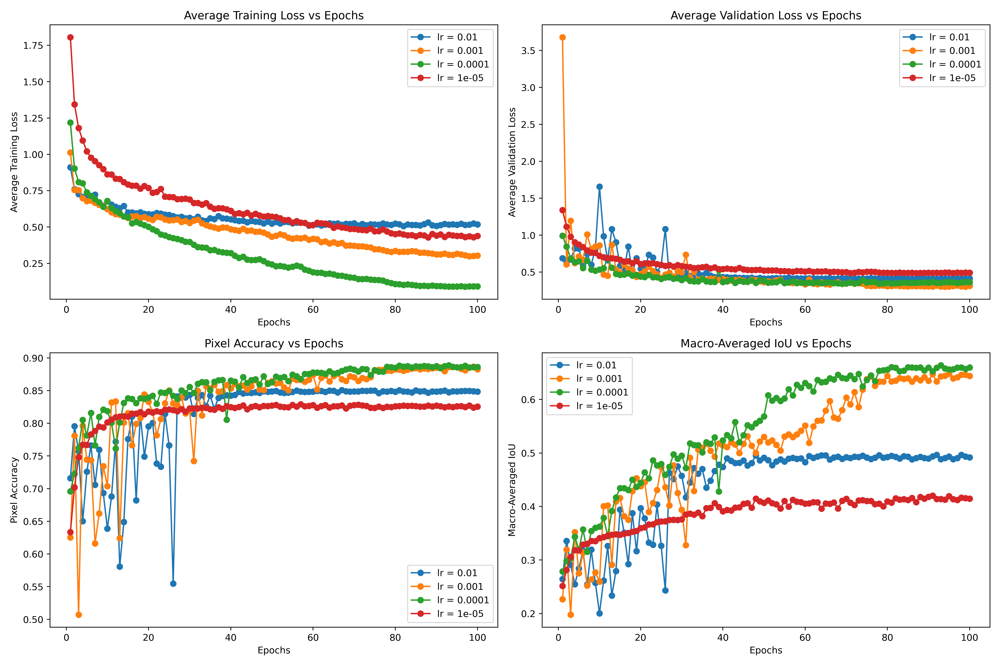

# Multi-Spectral-Land-Use-Segmentation

This project tackles the problem of land use semantic segmentation from high-resolution satellite imagery, where each pixel of an image is classified into a discrete set of land cover categories. We begin with downloading low-cloud-coverage Sentinel-2 (satellite) image data from the Copernicus platform, focusing on Thessaly, Greece for the training data and on Pelloponese, Greece for the testing data. 

We process these images by pansharpening all spectral bands to 10 m resolution, aligning coordinate systems, and creating a balanced patch-based dataset. We normalize the data, augment them with geometric and radiometric transformations and split them into training and validation sets. The chosen architecture is a U-Net variant that incorporates a pretrained ResNet-50 as the encoder, which is a natural choice for the task of semantic segmentation. More specifically, the encoder leverages a ResNet-50 backbone pretrained on ImageNet, which provides a strong initialization based on rich hierarchical feature representations. To accommodate multi-spectral input data (e.g., 13-channel Sentinel-2 imagery), the first convolutional layer of ResNet-50 has been replaced with a custom convolutional layer that accepts the desired number of input channels. The remainder of the encoder retains the original ResNet-50 layers, namely the residual blocks of layer1 through layer4, which extract increasingly abstract features while progressively reducing the spatial resolution of the input. The decoder is built using a series of transposed convolutional layers, which upsample the encoded features back to the original input resolution. At each decoder stage, features are concatenated with the corresponding encoder features via skip connections. These skip connections help preserve spatial detail that might otherwise be lost during downsampling and improve gradient flow during training. Specifically, the decoder progressively upsamples and merges features from the encoder’s layer4 to layer1 using concatenation and transposed convolutions. To compensate for the initial downsampling performed by the encoder, including the stride-2 convolution and max pooling, the final upsampling operation uses bilinear interpolation to restore the output to the original input resolution. The final 1×1 convolutional layer maps the decoder output to the desired number of classes, producing a pixel-wise class probability map. Training involved the Adam optimizer with a reduce-on-plateau scheduler, using cross-entropy loss and monitoring pixel accuracy and macro-averaged IoU. 

A grid search over learning rates revealed that 0.0001 offered the best trade-off, achieving a macro-averaged IoU of 0.6638, pixel accuracy of 0.8887, and composite score of 0.7763 on validation data. Results showed strong performance on majority classes but weaknesses on underrepresented categories, reflecting the dataset’s imbalance.

